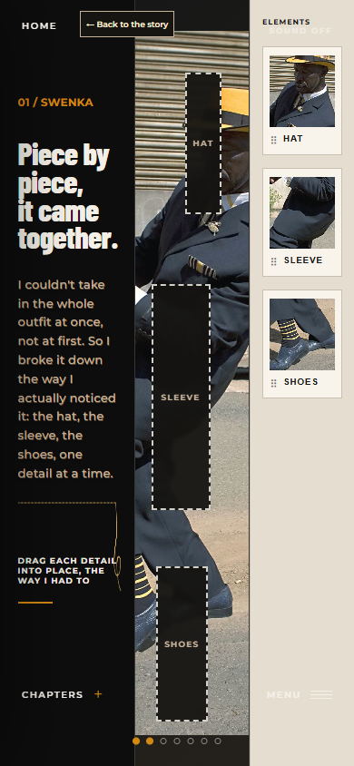
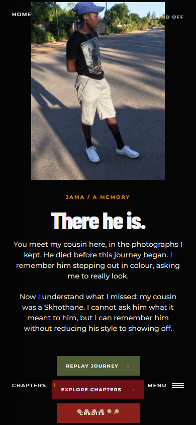

# I Styla Senkosi Detailed Progress Report

## Review of the revised project and remaining work

Prepared for Nandi Mpofu | 22 September 2026

**Overall assessment: an advanced working prototype with a substantially clearer personal story, but with unfinished documentary support, interaction defects and presentation issues that prevent it from being treated as a finished submission.**

The strongest progress is the connection between Jama's search and her late cousin Ree. The introduction now names him, the map becomes a search for traces of him, and the final reflection returns to his photographs. The project also contains considerably more interaction than the earlier diagram suggests: chapter entrances, clothing preparation, shoe decoration, an outfit selection activity, photographic albums and memory stitching. These are implemented features, rather than proposals waiting to be built.

The next phase should concentrate on making that existing work reliable, understandable and properly documented. Adding more effects is a lower priority than completing credits and captions, resolving navigation conflicts, correcting the completion counter, improving the phone layout and collecting evidence from first-time viewers.

### What this report is based on

- The current project at commit **35c9421**, with recent changes through 22 September 2026. The recent history and differences across the latest three commits were inspected, alongside the earlier report.
- The five chapter pages, shared chapter player, navigation, settings, text and sound systems, chapter entrances, map, albums and principal activities.
- The existing Second Iteration Progress Report, read as a historical account. Its statements about earlier presentations and feedback were not independently reverified against those original presentations.
- A fresh production build, a code-quality check, and all four existing test files containing 15 tests.
- Twelve local browser captures: six selected screens at 1440 by 900 and 390 by 844. These used saved chapter positions and reduced motion so individual screens could be inspected consistently.
- Five targeted browser checks for the wardrobe, map, Credits button and hidden chapter navigation.

### How to read the assessment

**Verified** means directly observed in a check or visible in the source files. **Implemented but not fully validated** means the code exists, but this review does not establish its quality across every device and complete viewing session. **Not found** means absent from the inspected project; it does not mean that you have not done the work elsewhere. **Recommendation** means a proposed improvement rather than a requirement supplied by your lecturer.

This is a project audit, not a grade or a percentage-complete estimate. The assessment brief and marking rubric were not available in the inspected files. The website source was not changed during this review.

<!-- page -->

## 1 What has changed since the earlier report

### The personal motivation is more specific

The introduction now identifies the cousin as Ree and states that Jama wants to understand him beyond the clothes after his death. The current wording also explains why she starts with Swenka even though Ree was a Skhothane: she is looking back at township style to understand care, pride and self-expression. This improves the rationale for the sequence. Previously, the connection could depend too heavily on an explanation outside the site.

The map now uses the title **Traces of Ree**, three personal memory stops and additional fashion photograph pins. The journey is no longer presented only as movement between places. The current text asks the viewer to look for traces of a person within those places.

### Documentary clips are now explicitly integrated

There are seven dedicated files in the video-clips folder: a Soweto arrival and two clips for each fashion chapter. Swenka uses voices and preparation; Pantsula uses movement and voices; Skhothane uses expression and voices. The chapter definitions request 20-second playback windows and enable skipping after 10 seconds of watched playback.

Bridging text now introduces or follows these clips. This is a meaningful response to the earlier report's concern that visual material needed a clearer place in the story. However, a file name and playback window cannot establish whether an interview edit preserves a speaker's full meaning. That still needs an editorial review with transcripts and source timecodes.

### Participation is more developed

- Swenka opens through a zip, asks the viewer to place three outfit details, and later adds shoe polishing before testimony.
- Pantsula includes rubbing and shaping an ispoti, a five-step beat activity, and a shoe decoration interface with patches, initials and adjustment controls.
- Skhothane includes a shirt-burning entrance, a nine-image carousel, a backpack with three clothing categories, and several page-turning albums.
- Reflection starts by joining seven seams across a torn photograph of Ree before the quieter closing sequence.

The earlier description of a Converse lacing activity is now outdated. The current component still has that filename, but the visible activity is shoe customisation, not lacing.

### Technical changes support the experience

Recent revisions include backward scrolling, improved drag handling, photo-album navigation, quieter music beneath video, chapter audio fades and a Swenka follow-up track. Three newer test files cover gesture behaviour, backward scrolling and audio, alongside the map tests.

**Remaining distinction:** implementation progress is clear. There is still no inspected evidence that first-time viewers understand the story or complete the activities without help.

<!-- page -->

## 2 The current experience in its actual order

The newest simple diagram is useful as an overview, but it omits several interactions and places too little emphasis on the entrances. The following sequence reflects the current files. The Home screen and the five chapter sections are distinct; the map is inside Introduction, not a sixth independent chapter.

### Home and Introduction

Home contains an animated photographic collage, the documentary title, the subtitle and Begin Journey. Begin Journey clears saved journey state and starts Introduction. Introduction then presents its title and context, four narrative image frames, the interactive map, and a separate Soweto arrival clip before Swenka.

### Swenka

The zip entrance comes first, followed by the chapter title and context. The wardrobe activity precedes the first video. The chapter then presents the first voices clip, an observation gallery, shoe polishing before the preparation clip, a memory gallery, and a final fashion collage with a link to Pantsula.

### Pantsula

The viewer rubs the crown and bends the brim of the ispoti before entering. After the chapter title, the beat activity comes before the narrative frames. The first video frame is gated by shoe decoration. The chapter then moves through movement footage, observational imagery, testimony, a personal memory and a final collage leading to Skhothane.

### Skhothane

The match-and-shirt entrance comes before the chapter title. A nine-photo carousel follows. The next stage asks the viewer to open the cousin's backpack and choose a shirt, jeans and shoes before the expression clip. Two album frames follow, then another voices clip, a further memory album and the final collage leading to Reflection.

### Reflection

The viewer stitches together the torn photograph, then enters the reflection title and four reflective frames. The final screen presents Ree's photograph and the heading There he is. It offers Replay Journey, Explore Chapters and Credits, although their current destinations need correction or clearer labelling.

### Why this matters for your documentation

The underlying chapter player contains 6 Introduction pages, 7 Swenka pages, 7 Pantsula pages, 8 Skhothane pages and 6 Reflection pages: **34 internal page positions**. This excludes Home, chapter entrances, the arrival dialog and activities placed over a video frame. It is not a measure of viewing duration.

Update the final flow diagram, script and progress presentation to show the actual order. In particular, the main activity generally comes before the documentary frames in the three fashion chapters. Avoid describing the finished sequence as video followed by a generic story grid when the current experience works differently.

<!-- page -->

## 3 Introduction and map progress

### Completed or visibly implemented

- Jama introduces herself, names Ree and explains the loss before the journey begins.
- Four introductory frames move from familiar Johannesburg imagery to looking beyond the city she knows.
- The map has three narrative stops, a draggable marker, a highlighted route and buttons for moving between stops.
- Keyboard controls exist for the marker, including arrow keys, Home and End. The mathematical map tests pass.
- Zoom buttons, a reset control, map panning and selectable fashion photograph pins are implemented.
- The route supports a saved position within the browser session. A fast forward drag pauses at the middle memory stop.
- Enter Soweto leads to a dedicated arrival clip and narrative bridge.

### Missing or requiring correction

**M01 - Resolve the map scroll conflict. Verified in the browser.** The instructions say that scrolling lets the viewer look closer, but an upward wheel movement over the map returned from map page 5 to narrative page 4. The parent chapter's backward-scroll handler captures the event before the map can use it. Keep map zoom local to the map and provide an explicit, predictable way back to the story. Completion evidence: zoom in and out repeatedly without leaving the map unintentionally.

**M02 - Improve map orientation. Recommendation grounded in the screen.** At phone size, the photograph of a broad regional map dominates while the tiny route and pins are hard to distinguish. Make Home, the intermediate memory and Soweto readable at the default scale. The source calls the route illustrative and the screen calls it a personal geography; retain that distinction rather than presenting the pins as researched coordinates.

**M03 - Give photograph pins individual editorial information. Verified in source.** The pin titles and descriptions currently repeat according to their folder category, and their positions are generated from image order. Add image-specific subject, location where known, source and relevance. Do not imply that automatically placed pins identify where each photograph was taken.

**M04 - Add an escape from unavailable arrival media. Verified in source.** The arrival clip supports retry, but Escape is suppressed and Skip stays disabled until ten seconds have played. A permanently unavailable video therefore leaves the viewer in a modal without a working continuation route. Offer Continue without video or an equivalent accessible text route after a failure. Test with the clip deliberately blocked.

**M05 - Correct arrival copy and complete optional memory content.** The bridge currently contains the visible string `my cousin?s world`. Replace the question mark with the intended apostrophe. The three route stops have `media: null`; this is optional capacity, not a broken feature. Add stop-specific recordings or photographs only if they genuinely enrich the memory rather than filling every available slot.

<!-- page -->

## 4 Swenka progress

### What the chapter now achieves

The chapter has a coherent intention: attention to dressing becomes attention to the person. The zip makes clothing a point of entry; the wardrobe breaks an outfit into a hat, sleeve and shoes; the polishing activity foregrounds preparation. Two video clips give the chapter a place for participants' voices. The text then connects that care to Jama's recollection of Ree checking his appearance.

The closing collage draws on the Boys of Soweto and Broke image folders. It moves the chapter beyond an isolated historical frame and prepares the question of what movement can communicate in Pantsula. The audio system also supports a change from Khawuleza to Nongqongqo after the first track ends. The automated audio tests cover that handoff, but this review did not conduct a complete listening assessment.

### Missing or requiring correction

**M06 - Validate wardrobe destinations. Verified in the browser.** Selecting HAT and clicking the SHOES target revealed the hat. Every target calls the same placement function using the selected item, without checking the target's identity. The activity therefore accepts a wrong placement while visually implying a matching exercise. Either require matching item and destination, or redesign the labels and explanation as free exploration.

**M07 - Complete keyboard placement. Verified in the browser.** After selecting HAT, focusing its target and pressing Enter did not place it. The target is a focusable element with a button role, but no corresponding keyboard activation handler. Make the complete activity achievable with keyboard input. Completion evidence: place all three details without a pointer and reach the next story stage.

**M08 - Redesign the phone layout. Verified visually at 390 by 844.** The wardrobe remains a narrow three-column composition. Text stacks into a tall strip, the portrait is heavily constrained, instructions collide with the available width and the light wardrobe panel makes the global controls harder to read. Use a stacked arrangement or a compact selection tray with a sufficiently large portrait. A lack of horizontal page overflow is not proof that this layout is usable.

**M09 - Edit the preparation transition. Verified in source.** The phrase `This desire look good despite hardship` needs `to`. The preceding bridge also needs a punctuation and wording pass. These are particularly noticeable because the text carries the transition from testimony into Jama's reflection.

### Editorial decision still needed

Check that each photograph is being presented with the correct cultural and historical context. The current mix contains contemporary fashion, archival portraiture and other named cultural references. Their folder placement does not establish that they all depict Swenka. Label contemporary influence, comparison and direct documentary evidence distinctly. This is an attribution and interpretation task; it should not be solved by making an unsupported historical claim in the narration.

<!-- page -->

## 5 Pantsula progress

### Completed or visibly implemented

- An ispoti entrance asks the viewer to wear in the crown and pull the brim upward. It includes keyboard alternatives and staged instructional text.
- The beat activity reveals five dance stages through sequential buttons, supported by six images including the starting pose.
- The shoe activity supports patches, initials, dragging or tapping to place, resizing, rotation, removal, zoom and comparison with the original photograph.
- Keyboard placement and movement instructions exist for shoe decorations.
- Two edited video files are linked, with observation and memory frames between and after them.
- The final collage explicitly directs the viewer towards Skhothane, bringing the story closer to Ree's own style.

### Missing or requiring correction

**M10 - Make beat sounds obey the sound setting. Verified in source.** The beat activity creates oscillator sounds directly and does not read the shared sound or volume preferences. Background music can be switched off while these generated sounds still play. Decide whether the control governs all sound or only music, then apply that decision consistently and label it accurately. Test with sound off, volume zero and sound restored.

**M11 - Describe the beat activity accurately. Editorial decision.** It currently advances through five clicks and plays generated tones; it does not measure timing against a song or score rhythmic accuracy. Calling it a sequence for noticing movement is supported. Calling it a rhythm test would overstate the implementation. Only add beat synchronisation if it materially serves the documentary and time permits.

**M12 - Improve the phone order and controls. Verified visually.** The shoe preview and rotation controls appear above the introductory explanation. The patch controls begin near the bottom of the captured screen, underneath the fixed Chapters and Menu controls. Scrolling may expose more content, but the initial view does not clearly establish the task before presenting its tools. Put a concise instruction first and reserve space for persistent navigation.

**M13 - Decide what should survive revisits. Verified in source.** The chapter page is stored, but beat progress, shoe decorations and hat shaping use local component state. Returning or reloading can therefore restore the stage without restoring the work done within it. Either save meaningful activity state or make restarting explicit. Do not promise that the viewer can resume everything exactly where they left off.

### Pacing question to test

Pantsula contains hat shaping, chapter context, the beat sequence and shoe customisation before the first movement clip. This may communicate preparation, but it also creates a long path to the documentary footage. Observe first-time viewers and record how long they take to reach the clip. If the actions delay their understanding, shorten an entrance or make an activity optional. This is an untested pacing concern, not a finding that all viewers dislike the sequence.

<!-- page -->

## 6 Skhothane progress

### What has improved

The chapter now differentiates photographs of other Skhothanes from Jama's memories of Ree. Album labels explicitly state that the images show other people who remind her of him. That is a useful correction: the audience should not mistake every portrait for a family photograph.

The nine-image carousel offers drag, wheel, keyboard and button controls. It unlocks continuation after reaching the final image. Several later albums use page turns, individually written memory prompts and dedicated Back to the story and Continue the story controls. The backpack activity adds a more personal relationship with clothing by letting the viewer select a shirt, jeans and shoes before hearing the next clip.

### Missing or requiring a decision

**M14 - Clarify the status of the backpack and clothing. Evidence gap.** The screen says these are the cousin's belongings. The inspected project contains imported clothing cut-outs, but no item-level provenance record establishing that they depict Ree's actual possessions. If the activity is a reconstruction or imaginative device, identify it as such. If it uses his belongings, document that connection. This report cannot determine which is true from filenames alone.

**M15 - Reconsider what the burning entrance communicates. Editorial recommendation.** The narration asks viewers to look beyond spectacle, yet the required entry action is to set a shirt alight. That may reinforce the association the chapter later questions. Keep it only with clear contextual justification and a connection to the testimony; otherwise consider an entrance based on colour, choice or preparation. This is about the documentary's argument, not a claim that the effect is technically unfinished.

**M16 - Fix the backpack header collision on phones. Verified visually.** The global Home control overlaps Back to the story at the top of the 390-pixel capture. The activity needs its own reserved header area or different placement for the back control.

**M17 - Restrict album keyboard handling to its own context. Verified in source.** MemoryFlipbook attaches a capture-phase left/right arrow handler to the window. It excludes text fields, but can still intercept arrow keys while focus is elsewhere, including on controls outside the album. Scope the handler to the focused album and suspend it when a modal is open. Validate the menu's volume slider while an album is behind the dialog.

**M18 - Evaluate repetition and geographic context. Recommendation.** The carousel, three memory-album frames and final collage create several successive ways of browsing pictures. Give each a distinct narrative purpose or remove repetition. The mixed source folders and captions also need an editorial check before images are read as direct evidence of a specific place or style.

A useful completion test is whether a viewer can explain one change in Jama's assumptions after this chapter, rather than only remembering bright clothing or the burning effect.

<!-- page -->

## 7 Reflection and the closing experience

### Completed or visibly implemented

The memory-stitching entrance is closely connected to the project's visual language and story. Seven seams join a fragmented photograph, using a real cousin-image asset already present in the project. The action makes the idea of carrying fragments through the previous chapters tangible.

The chapter then slows down through street, building and house imagery, followed by the cousin photographs. The closing text acknowledges a limit: Jama cannot ask Ree what the style meant to him, but can remember him without reducing it to showing off. That is a stronger ending than claiming to have fully explained another person's motives.

### Missing or requiring correction

**M19 - Build a real Credits destination. Verified in source and browser.** Clicking Credits changes the active section to Home. No credit list appears. Create a dedicated panel or page and connect the control to it. Include contributors, interview participants, image makers, source archives, video sources, music details and any relevant reconstruction or tool acknowledgements.

**M20 - Align the other final buttons with their labels. Verified in source.** Replay Journey currently returns to Home; the actual reset occurs only when Begin Journey is clicked there. Explore Chapters directly opens Swenka at its saved position rather than opening the chapter chooser. These can be legitimate choices, but the current labels set different expectations. Make Replay restart directly or label it Return home; make Explore Chapters open the chooser.

**M21 - Repair the closing phone layout. Verified visually.** Progress dots sit over the Credits button, while the fixed chapter/menu controls overlap the area around Explore Chapters. Reserve a bottom navigation zone and move or hide page dots on the final screen. Completion evidence: all three final actions can be read, focused and selected without overlapping elements at phone sizes.

**M22 - Resolve the remaining narrative promise. Editorial recommendation.** The introduction already states that Ree was a Skhothane, so the ending's real discovery is a change in how Jama sees him, not the fact of his identity. Consider replacing the phrase that frames this as newly understood with wording about care, judgment and unanswered questions. The chapter-navigation description also still promises where township fashion goes next, while the actual reflection is primarily about memory.

The Home subtitle promises Past, Present and Future of Township Fashion. Either give the future an explicit, supported place through participant perspectives and contemporary continuation, or narrow the promise. A personal commitment to keep listening can support Jama's future, but does not by itself provide an account of the future of township fashion.

Check the location context of the reflection imagery too: several files are under Wattville, while the narration refers to Soweto. Different places may belong in the journey, but they should not be silently treated as interchangeable.

<!-- page -->

## 8 Navigation persistence and interaction reliability

### What is working at the structural level

The project uses one shared chapter framework and a central navigation context. This reduces duplication across chapters. The chapter chooser offers free access, while page and gallery positions are saved in session storage. Settings persist in local storage. A dedicated restart action clears journey keys, and backward navigation can return to the last page of the previous section.

The newer tests show deliberate attention to accidental drag completion, transition locks, reverse-scroll momentum and audio continuity. These are valuable safeguards, but their scope is smaller than an end-to-end journey test.

### Missing or requiring correction

**M23 - Replace the completion counter with actual completed chapters. Verified in source.** The Profile counter derives completion from the highest reached order index. Completing Introduction can count as one of four chapters; jumping ahead can imply completion of sections not visited. Conversely, the explicit next-chapter buttons navigate directly and bypass the completion update. The counter also resets on reload because it is ordinary component state, even though other journey state survives. Record completed chapter IDs, decide whether Introduction counts, and persist the same truth shown to the viewer.

**M24 - Make Return to the current chapter actually resume. Verified in source.** The Profile return action calls the same helper used for explicit chapter visits, which resets page and gallery positions to zero. A viewer closing Settings through this action may be sent back to the chapter entrance instead of the previous reading position. Separate resume behaviour from start-chapter behaviour.

**M25 - Fix hidden chapter navigation and modal behaviour. Partly verified in browser.** A button in the closed chapter drawer can still receive focus. The drawer is moved offscreen and marked hidden to assistive technology but is not made inert. It also lacks the native dialog behaviour already used for Settings. Make closed content unfocusable; support focus containment, Escape and focus restoration when open. The browser check demonstrated focusability, not a complete screen-reader audit.

**M26 - Review gesture ownership across activities. Verified conflict plus broader recommendation.** The map wheel conflict is a confirmed example. The same parent capture mechanism can take precedence over local carousel or activity wheel handlers. Define when a gesture belongs to the current activity and when it changes chapter pages, then test both forward and backward movement in each mode.

**M27 - Define the browser navigation promise. Verified architecture.** Chapter changes are state changes within the same route; they do not create individual chapter URLs. Browser Back, shareable chapter links and reload expectations need a deliberate decision. Deep links are an optional improvement unless required by the brief. At minimum, the site should explain and consistently support its own back, restart and resume controls.

<!-- page -->

## 9 Documentary evidence and accessibility

### Documentary support still missing from the inspected project

**M28 - Captions and transcripts.** No subtitle files or video track elements were found in the active implementation. The `caption` values such as 20 SECOND CLIP are production labels, not subtitles. Provide accurate speech captions, speaker identification, relevant sound information and translations where appropriate. Check whether any subtitles are already burned into the footage; this review did not transcribe or assess the full clips. A text alternative is still needed for viewers who cannot access the media.

**M29 - An asset and contribution register.** No consolidated source or consent register was found. Record each used asset's creator, source, original date if known, use in the documentary, edit or crop, credit wording and permission or licence evidence. Distinguish your own photographs and interviews from archive material and reconstructions. This is an evidence gap, not a conclusion that permissions do not exist.

**M30 - Speaker and source identification around clips.** Current bridges foreground Jama's response, but the player does not render structured speaker names, roles, source titles or original timecodes. Add the information necessary to understand whose testimony is being heard and where it comes from. If these are already embedded in the video, document that and check legibility on a phone.

**M31 - A source-supported editorial script.** No standalone, current script linking narration, images, quotations and timecodes was found. Create one that distinguishes participant testimony, historical explanation, Jama's interpretation and reconstructed memory. Also clarify whether Jama is a documentary narrator, a fictional guide or a composite device. Do not retrospectively present invented narrative detail as recorded testimony.

### Accessibility is started but incomplete

There are useful foundations: labelled buttons, status messages, keyboard options in several activities, a native Settings dialog, accessible duplicate text for animated words, and both system and in-site reduced-motion support in several components.

**M32 - Complete image descriptions and accessible alternatives.** Many narrative photographs default to empty alternative text, while other albums use numbered generic labels. Identify which images are decorative and which carry documentary information. Meaningful visual evidence needs a concise description or adjacent explanatory text. Provide a way through every compulsory activity without precise dragging or repeated physical effort.

**M33 - Complete the media controls and failure states.** The main chapter videos have no standard pause/replay controls, no rendered caption switch and no explicit media-error continuation. They auto-transition near the end of their configured playback window. Add a practical way to pause, reread, replay and continue if loading fails. Respect the viewer's sound choice: starting a clip currently sets global sound on.

**M34 - Audit the whole accessible journey.** Test keyboard-only completion, visible focus, focus order, reduced motion, text zoom, readable contrast and touch targets. Existing support is not evidence of full compliance. The hidden drawer and wardrobe keyboard failure are already confirmed examples requiring correction.

<!-- page -->

## 10 Build media performance and maintenance

### Checks completed on this revision

- **Production build: passed.** The current imports resolve and Vite produced the deployment output.
- **Code-quality check: passed.** The lint command completed without reported errors.
- **Existing tests: 15 passed.** These cover four drag tests, four map tests, three reverse-scroll tests and four audio tests.
- **Browser screen checks: no JavaScript page errors recorded in the twelve sampled views.** No horizontal document overflow was measured, although the visual checks still found cramped and overlapping content.

The usual multi-process test invocation was blocked by a local process restriction. Running the same four test modules in one process passed all 15 tests. This was a test-runner environment issue, not evidence of a failing application assertion. The successful build does not verify the live deployment, media rights, editorial accuracy or complete usability.

### Size findings

The fresh distribution contains **154 files totalling 127,263,273 bytes**, approximately **127.3 MB** in decimal units. This is the total build output, not a measured first-page network transfer. The JavaScript bundle is approximately 362.45 kB before compression and 113.32 kB gzipped; the CSS is approximately 133.54 kB before compression and 28.25 kB gzipped.

The heavier assets include the 14.41 MB Stimela track, 7.58 MB arrival video, 5.45 MB Johannesburg photograph, 5.41 MB Skhothane voices clip and 4.96 MB Pantsula movement clip. Several other photographs are between about 2.6 and 4.0 MB. This makes media optimisation a more immediate target than assuming the application code itself is the main performance problem.

### Remaining tasks

**M35 - Optimise assets and measure actual loading.** Resize photographic originals for their displayed use, provide appropriate compressed variants, shorten or encode audio for the intended experience, and inspect video dimensions and bitrates. The Introduction seeks four minutes into the original Stimela file; it still ships the whole file. Measure first meaningful display, chapter-change delay and total transferred data under a representative slower connection before setting a final budget.

**M36 - Finish the project handover files.** README is still the generic React and Vite starter document. Replace it with setup, chapter structure, authoring instructions, media notes, test commands, deployment steps and known limitations. Add a normal test script and run tests and lint in the deployment workflow. The current workflow builds and deploys but does not run those checks.

**M37 - Clean up the deployment and repository record.** The package exposes a gh-pages deployment command, but gh-pages is not declared among its dependencies; the separate GitHub Actions deployment route is configured. Choose and document the intended path. Remove or quarantine the incomplete `.crdownload` file and audit obsolete components before deleting them. Use descriptive commit messages; names such as change and xha make revision evidence difficult to reconstruct. Improve the browser title and add a project description for sharing.

<!-- page -->

## 11 Evidence from the current browser checks

These captures come from the current local production build, not the earlier report. Saved page positions were used to inspect selected activities directly. The captures do not demonstrate that every preceding action has been completed or that every later control works.

**Figure 1. Swenka at 390 by 844.** The three-column composition persists at phone size. The left text column is cramped, the portrait is narrow, the activity instruction wraps awkwardly and global controls sit against competing backgrounds. This is why responsive completion must be judged visually, not just by whether the page fits the viewport width.

**Figure 2. Reflection at 390 by 844.** The personal closing image and copy are present. The lower action area still conflicts with persistent navigation and the progress dots, including dots over Credits. The final screen needs a dedicated layout pass.

<!-- page -->

## 12 Confirmed interaction findings and test limits

### Five targeted checks

1. **Wrong wardrobe destination accepted.** Select HAT, then click the SHOES target. The hat becomes revealed. Expected outcome for a matching activity: the wrong target should not complete the item.
2. **Wardrobe keyboard placement fails.** Select HAT, focus the HAT drop target and press Enter. The item remains unrevealed. Expected outcome: keyboard activation should perform the equivalent valid placement.
3. **Map zoom gesture navigates backward.** Open Introduction at the map, point at the map and scroll upward. The stored page changes from 5 to 4 and the map disappears. Expected outcome under the current instruction: zoom closer while remaining on the map.
4. **Credits leads to Home.** Open the final Reflection screen and select Credits. The active section becomes about. Expected outcome: credits appear.
5. **Closed chapter content remains focusable.** Focus the first chapter link while the drawer is closed. Focus moves to that hidden control. Expected outcome: closed offscreen navigation is unavailable until opened.

### What was not established by these checks

This review did not complete every chapter from a fresh start through every activity with ordinary animation enabled. It did not run on a physical iPhone or Android device, test Safari, perform a full screen-reader session, measure loading on mobile data, or listen to every song and clip from beginning to end. It did not verify the current public GitHub Pages deployment or the Trello board.

The 15 automated tests are focused checks of particular logic. They do not cover final button destinations, wardrobe correctness, chapter-completion bookkeeping, photo-album modal interactions, captions, media failure recovery or the complete user journey. Their success is useful evidence, but cannot be used to claim that the documentary is finished.

### Three further evidence gaps

**M38 - First-time viewer testing.** No current results, participant notes or issue log were found in the inspected project. Run short sessions without explaining the controls or story in advance. Record where people hesitate, what they believe the actions mean and how they describe Jama and Ree afterwards.

**M39 - Current process documentation.** The earlier report contains claims and screenshots from previous stages. The newest simplified flow diagram omits current entrances and in-chapter gates. Update the diagram and collect dated before-and-after examples with reasons for each major revision. Include failed approaches and what they taught you.

**M40 - Submission requirements and release evidence.** The current assessment rubric, final deadline and submission checklist were not present. Confirm those separately, then check the actual hosted build, final URL, device expectations, credits and required report components against them. Do not assume that the technical tasks in this report are the whole marking brief.

<!-- page -->

## 13 What to finish first

### Priority 1 Remove blockers and misleading behaviour

Complete M01, M04, M06, M07, M19, M20, M23, M24, M25 and M33 first. These concern navigation, unavailable video, incorrect activity completion, keyboard access, final destinations, saved progress and media control. They affect whether a viewer can trust the interface or continue through the work.

**Acceptance evidence:** a recorded or logged walkthrough showing successful keyboard and pointer completion; correct matching; map zoom that stays on the map; a failed video that offers a way forward; a real Credits destination; and an accurate completion record after both sequential viewing and chapter jumping.

### Priority 2 Finish documentary communication

Complete M14, M15, M22 and M28 through M32 alongside the functional repairs. These concern reconstructed possessions, the burning entrance, the promise of the ending, captions, provenance, speaker identification and the editorial script. They determine what the viewer understands and what the work can responsibly claim.

**Acceptance evidence:** a source-linked script, checked transcripts, readable subtitles, clear speaker information, a complete asset register and credit list, and an explicit distinction between recorded material and interpretation. Have someone unfamiliar with the project read the script and describe the central question.

### Priority 3 Make the existing experience comfortable

Complete M02, M03, M08 through M13, M16 through M18, M21, M26, M34 and M35. These cover orientation, image-specific copy, phone layouts, sound consistency, activity descriptions and state, album behaviour, repeated content, gesture ownership, accessibility and media weight.

**Acceptance evidence:** useful desktop and phone screenshots, a device test matrix, headphone and speaker listening notes, a measured loading comparison and observations from first-time viewers. Preserve interactions that help understanding; simplify those that mainly prolong entry into the footage.

### Priority 4 Complete the submission record

Finish M05, M09, M27 and M36 through M40 as appropriate, while recognising that the copy corrections themselves are quick fixes. Document the chosen navigation model, update README, add automated checks to deployment, clean the asset library and replace vague revision notes with specific decisions.

### Features you do not need to add automatically

A backend, account system, public comments, social sharing, more games and additional visual effects are not evidenced requirements for this project. The current local profile can remain a device preference if that is its intended role. User-written reflection or downloadable shoe designs could be extensions, but should not displace captions, credits and reliability. The unfinished work is substantial enough without expanding the scope.

The missing-item identifiers M01 to M40 are a working checklist. Some are verified defects; others are editorial decisions or missing evidence. They should not all be described as bugs in your progress presentation.

<!-- page -->

## 14 Proposed four week completion plan

This is a proposed schedule beginning 23 September 2026, not a claim about your assessment deadline. If the actual deadline is sooner, retain the priority order and reduce optional extensions. Keep a short decision log recording the issue, the change, the evidence and the next check.

### Week 1 from 23 to 29 September

**Focus: a dependable core journey.** Repair the wardrobe matching and keyboard path, the map scroll conflict, hidden drawer focus, resume behaviour, completion tracking and final buttons. Add media-failure continuation and practical pause or replay controls. Correct the known wording errors. Connect a credits structure even if the final entries are still being compiled.

**Deliverable:** a stable build with a complete defect checklist and a fresh-start walkthrough. Check sequential viewing, direct chapter entry, backward movement, reload and restart. Confirm that fixes do not remove the existing reduced-motion paths.

### Week 2 from 30 September to 6 October

**Focus: documentary evidence and editorial clarity.** Transcribe the used clips, identify speakers and sources, add captions and create the asset register. Resolve the status of the backpack and clothing imagery. Review the burning entrance and the promise of future fashion. Check that places and cultural references are described accurately in relation to the selected material.

**Deliverable:** a current script with source and timecode references, checked captions, a functioning credits page and an agreed ending. Record what was removed or reworded and why.

### Week 3 from 7 to 13 October

**Focus: real viewing conditions.** Repair the narrow-screen layouts and fixed-navigation collisions. Reduce the largest assets and compare actual load behaviour. Run keyboard, touch, sound-off and reduced-motion journeys. Conduct approximately five short first-time-viewer sessions as a practical starting point, including both phone and desktop viewing if available.

**Deliverable:** a test log with observed problems, representative quotes where participants consent, measured or recorded completion times and a prioritised revision list. Five sessions are a proposed practical sample, not proof of universal usability.

### Week 4 from 14 to 20 October

**Focus: final revision and submission evidence.** Apply the most consequential findings, repeat the affected checks, update the simple diagram and progress presentation, and replace the starter README. Verify the actual hosted build and prepare a local presentation fallback. Confirm the required submission format and deadline against the assessment brief.

**Deliverable:** the final release candidate, current report, source and credit records, dated process evidence, test summary and a concise account of what remains limited. Avoid adding new interaction types during this final consolidation unless testing exposes an essential need.

<!-- page -->

## 15 Viewer testing and evidence checklist

### Tasks to give a first-time viewer

1. Start the documentary and explain what you think Jama is trying to understand.
2. Explore the map, open a photograph, move between stops and continue to Soweto.
3. Complete the Swenka outfit activity and describe how it relates to the chapter.
4. Try Pantsula, then explain what the hat, beat and shoe actions added to your understanding.
5. Browse Skhothane and distinguish photographs of other people from memories of Ree.
6. Turn sound off, change its level, use reduced motion and return to the same place.
7. Move backward, reload, choose a different chapter, then resume.
8. Reach the ending, find the sources and explain what changed in Jama's perspective.

### Record evidence rather than impressions alone

For each session, note the device, browser, input method, whether sound was used, where help was needed, tasks completed, confusing labels, accidental navigation and moments the viewer wanted to skip or repeat. Ask the viewer to explain the story in their own words before asking leading questions about grief, identity or belonging.

A useful minimum success criterion is that the person can identify who Ree is, why Jama undertakes the journey, why the three styles appear, and what she can and cannot know by the end. For usability, the person should be able to continue without a presenter demonstrating the controls. These are proposed project criteria, not quoted course requirements.

### Evidence to add to the final progress submission

- The updated simple flow diagram, showing chapter entrances and the actual order of media and activities.
- A narrative outline stating what Jama notices, hears, remembers and reconsiders in each chapter.
- A dated before-and-after pair for the map, one chapter entrance, the text treatment and the ending.
- A short rationale for each major interaction, including any decision to simplify or remove one.
- A current media log, transcripts, caption files, source register, contributor credits and relevant permission records.
- A test matrix and a short issue log showing what was observed, what changed and what was rechecked.
- A measured loading comparison for the heavier media and a final phone-layout review.
- A final release record identifying the reviewed version, hosted URL, known limitations and backup presentation plan.

The earlier report already discusses authorship, dark overlays, music pacing and rough process evidence. Preserve that reflective work, but update its factual descriptions. Do not continue calling the shoe activity lacing, imply that an ending control works when it returns Home, or present an old screenshot as evidence of the newest revision.

<!-- page -->

## 16 File evidence and final assessment

All source locations below are relative to the project root. They identify where the reviewed behaviour is implemented so the findings can be revisited after further changes.

### Main story and navigation sources

- `istyla-senkosi/src/pages/Introduction.jsx`, `Swenka.jsx`, `Pantsula.jsx`, `Skhothane.jsx` and `Reflection.jsx`: current chapter order, text, image choices, clips and ending controls.
- `istyla-senkosi/src/components/ChapterPlayer.jsx`: internal page sequence, text locks, video gates, skip timing, sound activation, transitions and gesture handling.
- `istyla-senkosi/src/context/NavigationContext.jsx` and `src/components/MenuNav.jsx`: saved settings, navigation, restart, completion counter and resume behaviour.
- `istyla-senkosi/src/components/ChapterNav.jsx`: chapter drawer, descriptions and focus behaviour.

### Principal interactions and presentation sources

- `src/components/games/JourneyMapGame.jsx`, `journeyMapData.js` and `SowetoArrivalClip.jsx`: map, memory pins, arrival media and failure handling.
- `src/components/games/WardrobeGame.jsx` and `ShoeShine.jsx`: Swenka matching and polishing.
- `src/components/IspotiIntro.jsx`, `src/components/games/BeatGame.jsx` and `ConverseLacing.jsx`: hat shaping, beat sequence and shoe customisation.
- `src/components/SkhothaneBurnIntro.jsx`, `src/components/games/SkhothaneOutfit.jsx`, `SwipeCarouselGame.jsx` and `src/components/MemoryFlipbook.jsx`: burning entry, clothing selection, carousel and albums.
- `src/components/MemoryStitchIntro.jsx`, `StitchedNarrative.jsx`, `FloatingText.jsx`, `src/hooks/useSectionAudio.js` and `src/utils/reverseScroll.js`: stitching, narrative display, music and reverse navigation.
- Relevant CSS under `istyla-senkosi/src/styles`: the phone captures were checked against the actual current layouts, including ChapterGames, ChapterNav and Reflection.

The shorter `src` paths in this subsection are inside the nested `istyla-senkosi` application folder.

### Build and historical sources

- `istyla-senkosi/package.json`, `vite.config.js`, `index.html`, the four files under `tests`, and `.github/workflows`: build, checks and deployment configuration.
- `output/report/IStyla_Senkosi_Second_Iteration_Progress_Report.docx`: earlier account used for comparison, not treated as fresh proof of current behaviour.
- The latest three commits modify 59 files across media, components, styles, tests and report assets. Commit names alone are not a sufficient account of the design decisions.

### Final assessment

The project now has an identifiable authorial direction: Jama's encounter with township style changes how she remembers Ree. The interactions and visual language increasingly support that direction. Your strongest remaining opportunity is to show that the work communicates this without your explanation.

The final stage is therefore a combination of documentary editing, functional repair, accessible alternatives, mobile refinement and evidence gathering. Complete those tasks before treating the work as submission-ready. The report identifies 40 specific missing items or decisions, while separating implemented features from verified defects and untested audience outcomes.
